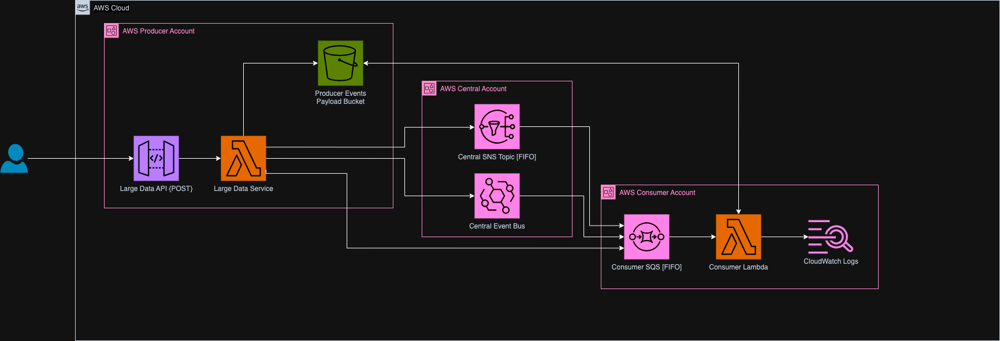

# AWS Large Payload Pattern

The AWS large payload pattern project provides an example of how to use s3 pre-signed URL's to transfer large payloads through AWS event based services with small payload size limits such AWS SNS, SQS and EventBridge.

An article explaining the functionality and code base can be found [here](https://jcdubs.medium.com/aws-large-payload-pattern-e3e4c57d402d). The below diagram outlines the full architecture of the solution.

## Useful commands

* `npm run build`   compile typescript to js
* `npm run watch`   watch for changes and compile
* `npm run test`    perform the jest unit tests
* `npx cdk deploy`  deploy this stack to your default AWS account/region
* `npx cdk diff`    compare deployed stack with current state
* `npx cdk synth`   emits the synthesized CloudFormation template
